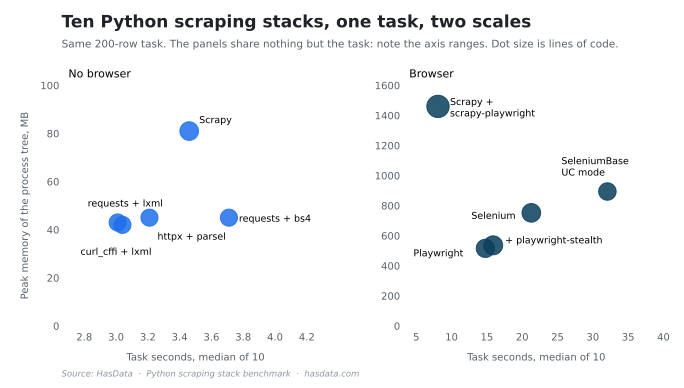

# Python Scraping Stacks Benchmark


One task, ten Python scraping stacks, measured. Every stack collects the same 200 rows from an eight-page catalogue, runs in its own fresh venv so imports and cold start stay honest, and reports wall-clock time, peak RSS, lines of code, and what a plain fetch of a protected page returns through it. The numbers back [our Python scraping libraries comparison](https://hasdata.com/blog/best-python-libraries-for-web-scraping?utm_source=github&utm_medium=syndication&utm_campaign=best-python-libraries-for-web-scraping&utm_content=python-scraping-benchmark-readme).

## Table of Contents

- [Results](#results)
- [What Is Measured](#what-is-measured)
- [Project Structure](#project-structure)
- [Running It](#running-it)
- [Disclaimer](#disclaimer)
- [More Resources](#more-resources)

## Results

`results/bench.json` holds one summary per stack, the median wall clock of 10 runs, peak RSS, lines of code, and the probe result:

| Stack | Wall clock | Peak RSS | Lines of code | Protected-page probe |
|---|---:|---:|---:|---|
| `requests` + lxml | 3.01 s | 43 MB | 21 | 403 |
| `curl_cffi` + lxml | 3.04 s | 42 MB | 21 | 403 |
| `httpx` + parsel | 3.21 s | 45 MB | 21 | 403 |
| `scrapy` | 3.46 s | 81 MB | 25 | 403 |
| `requests` + BeautifulSoup | 3.71 s | 45 MB | 21 | 403 |
| `scrapy-playwright` | 8.08 s | 1,460 MB | 36 | 403 |
| `playwright` | 14.79 s | 516 MB | 24 | 403 |
| `playwright` + stealth | 15.89 s | 536 MB | 26 | 403 |
| `selenium` | 21.29 s | 752 MB | 25 | challenge page |
| `seleniumbase` | 32.06 s | 894 MB | 22 | 200 |

The same table drawn as the article charts it:



The five HTTP stacks are within 0.7 s of each other, so parser choice matters more than client choice at this scale. And `seleniumbase` was the only stack whose plain fetch of the protected page returned a 200, at the price of being the slowest on the plain task.

## What Is Measured

The task collects 200 hockey-team rows from an eight-page paginated catalogue on a scraping sandbox. Per stack, the harness records 10 wall-clock timings and reports the median, polls the peak RSS of the whole process tree every 50 ms, counts non-blank non-comment lines of the implementation, and sends one plain fetch to a Cloudflare-protected page to record what comes back. Browser stacks install their Chromium into their own venv on first use. The published numbers come from Windows 11 Pro on an AMD Ryzen 3 5300U with 6 GB of RAM, Python 3.14.7.

## Project Structure

Each implementation is one file, each library example is one file.

```
python-scraping-benchmark/
├── bench_stacks.py     # the harness, venv per stack
├── deps_venvs.py       # builds the fresh venvs
├── examples_run.py     # runs the minimal per-library examples
├── impl/               # task_*.py, one per stack
├── examples/           # ex_*.py, minimal usage per library
└── results/            # raw JSON from the published run
```

The `examples/` files are the article's snippets kept runnable, and `results/examples_run.json` records their verification.

## Running It

`python deps_venvs.py` builds the venvs, `python bench_stacks.py` runs the measurement and writes `results/bench.json` incrementally, so an interrupted run doesn't start over. A full pass downloads browsers for the Playwright and Selenium stacks and takes a while on the first run.

## Disclaimer

The benchmark fetches publicly available pages from scraping sandboxes and records how public sites answer a plain request. Whether and how such collection is appropriate depends on jurisdiction and use, and nothing in this repository is legal advice. [Is Web Scraping Legal?](https://hasdata.com/blog/is-web-scraping-legal?utm_source=github&utm_medium=syndication&utm_campaign=best-python-libraries-for-web-scraping&utm_content=python-scraping-benchmark-readme) covers how we think about the question.

## More Resources

- [Best Python Libraries for Web Scraping](https://hasdata.com/blog/best-python-libraries-for-web-scraping?utm_source=github&utm_medium=syndication&utm_campaign=best-python-libraries-for-web-scraping&utm_content=python-scraping-benchmark-readme), the comparison these numbers back
- [Web Scraping with Python](https://hasdata.com/blog/web-scraping-with-python?utm_source=github&utm_medium=syndication&utm_campaign=best-python-libraries-for-web-scraping&utm_content=python-scraping-benchmark-readme), the broader tutorial
